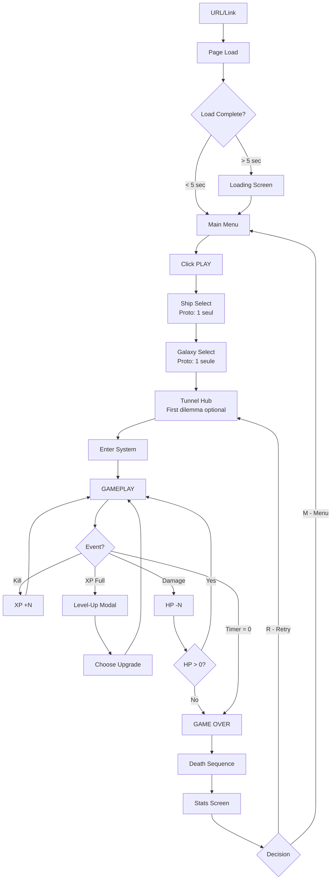
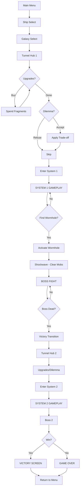
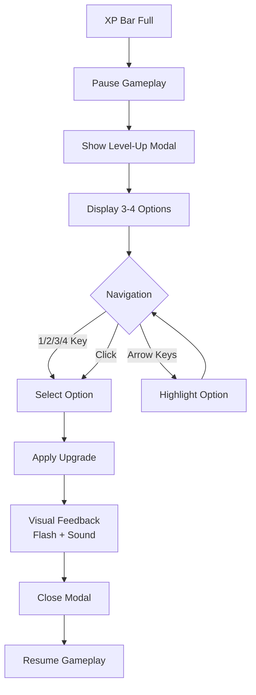
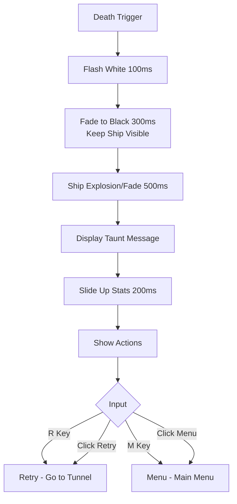

# UX Design Specification - three-spaceship-challenge

**Author:** Adam
**Date:** 2026-02-06

---

<!-- UX design content will be appended sequentially through collaborative workflow steps -->

## Executive Summary

### Project Vision

Créer le premier survivors-like 3D spatial de qualité jouable instantanément dans un navigateur. Le jeu combine l'accessibilité zéro-friction du web avec le "wow factor" visuel de Three.js/R3F pour se démarquer dans le concours Three.js Journey et potentiellement au-delà.

**Proposition de valeur UX :** Fun arcade immédiat, gratification visuelle, progression satisfaisante — le tout en un clic, sans téléchargement ni compte.

### Target Users

| Segment | Persona | Besoin UX principal | Métrique de succès |
|---------|---------|---------------------|-------------------|
| **Casual** | Alex, 28 ans, dev web | Session rapide, zéro friction, fun immédiat | < 5 sec pour jouer, session 10-15 min |
| **Engagé** | Marie, 24 ans, fan VS | Profondeur, builds, stratégie | Synergies satisfaisantes, rejouabilité |
| **Juge** | Bruno Simon | Excellence technique, polish | 60 FPS, shaders impressionnants |
| **Social** | Tom, ami curieux | Partage facile, moments mémorables | URL partageable, screenshots cool |

### Key Design Challenges

1. **Lisibilité vs Spectacle** — Équilibrer le chaos visuel (fun) avec la lisibilité (jouabilité). Le joueur doit voir son vaisseau et les menaces même quand l'écran explose d'effets.

2. **Onboarding invisible** — Contrôles apprenables en 30 secondes sans tutoriel explicite. Le jeu doit enseigner par le gameplay.

3. **Flow de level-up** — L'UI de choix d'amélioration doit informer sans frustrer, pausant l'action juste assez pour décider.

4. **Performance comme UX** — 60 FPS stable est une feature UX. Toute latence ou saccade détruit la sensation de qualité.

### Design Opportunities

1. **Différenciation 3D immédiate** — Le banking du vaisseau, les shaders, les particules créent un "wow" instantané qui distingue le jeu des survivors 2D pixel art.

2. **Viralité sociale** — URL directe + moments screenshot-worthy = partage organique facile.

3. **Tunnel comme respiration** — Le hub entre systèmes offre un contraste rythmique et une opportunité de décisions stratégiques calmes.

4. **Boucle de progression addictive** — Chaque level-up visible et ressenti immédiatement, alimentant le "just one more run".

5. **Game Over cinématique** — Transformer la mort en moment mémorable plutôt que frustrant :
   - Flash d'impact
   - Fondu rapide vers noir (vaisseau isolé, reste de l'écran s'efface)
   - Message taunt avec personnalité ("The galaxy is too big for you", "Space doesn't forgive", etc.)
   - Vaisseau qui disparaît/explose en fondu
   - Récap des stats (temps survécu, kills, niveau atteint, armes équipées)

   Ce moment crée une ponctuation dramatique qui rend la défaite acceptable et pousse au "one more run". Potentiel screenshot/clip pour partage social.

## Core User Experience

### Defining Experience

**Core Action : Le mouvement**

Le gameplay de three-spaceship-challenge se résume à une action fondamentale : **se déplacer pour survivre**. Le tir automatique élimine la complexité de la visée — tout le skill réside dans le positionnement, l'anticipation des vagues, et la navigation dans le chaos croissant.

Cette simplicité est intentionnelle : elle permet l'accessibilité immédiate tout en offrant une profondeur via les choix de builds et la lecture du battlefield.

**Core Loop :**
```
Mouvement (survie) → Kills automatiques → XP → Level-up (choix) → Power-up visible → Chaos accru → Répéter
```

### Platform Strategy

| Aspect | Décision | Justification |
|--------|----------|---------------|
| **Plateforme primaire** | Browser desktop (Chrome) | Cible concours Three.js, 0 friction |
| **Navigateurs secondaires** | Firefox, Safari | Compatibilité élargie |
| **Contrôles primaires** | Clavier (WASD/flèches) | Arcade feel, mains fixes |
| **Contrôles menus** | Clavier-first (flèches + Enter/Espace), souris en option | Accessibilité complète sans souris |
| **Mobile/Touch** | Bonus si temps | Non prioritaire pour le concours |
| **Offline** | Non requis | Jeu web connecté acceptable |

### Effortless Interactions

**Ce qui doit être invisible/magique :**

1. **Démarrage instantané** — Clic "Play" → écrans de setup rapides → en jeu sans attente perceptible
2. **Contrôles intuitifs** — WASD fonctionne immédiatement, pas besoin de lire quoi que ce soit
3. **Combat automatique** — Le joueur n'a pas à gérer le tir, il se concentre sur la survie
4. **Feedback de progression** — Chaque kill, chaque XP, chaque level-up est ressenti sans être intrusif
5. **Navigation clavier fluide** — Menus navigables sans jamais toucher la souris

**Ce qu'on élimine vs la concurrence :**
- Pas de tutoriel obligatoire
- Pas de compte/login
- Pas de téléchargement
- Pas de configuration de contrôles

### Critical Success Moments

| Moment | Timing | Critère de succès |
|--------|--------|-------------------|
| **Premier regard** | 0-5 sec | "Wow c'est beau" — qualité visuelle immédiate |
| **Premier mouvement** | 5-15 sec | Contrôles compris, vaisseau répond bien |
| **Premier kill** | 15-30 sec | Feedback satisfaisant (explosion, son, XP visible) |
| **Premier level-up** | 1-2 min | Comprend le système de choix, décision facile |
| **Premier "god mode"** | 3-5 min | Build commence à shred, power fantasy activée |
| **Game over** | Variable | Pas de frustration, envie de recommencer |
| **Replay decision** | Post-mort | "Just one more run" déclenché |

### Experience Principles

1. **Mouvement = Maîtrise** — Le seul input actif du joueur est le déplacement. Tout le reste (tir, abilities) est automatisé. La maîtrise vient de la lecture du chaos et du positionnement optimal.

2. **Friction Intentionnelle Uniquement** — Éliminer les obstacles inutiles (compte, tuto, config), mais les choix pré-run (vaisseau, galaxie, tunnel) sont rapides et font partie de l'expérience stratégique.

3. **Feedback Immédiat** — Chaque action a une réponse visuelle/audio dans les 100ms. Le joueur ne doit jamais se demander "est-ce que ça a marché ?".

4. **Clavier Souverain** — L'expérience complète est jouable au clavier seul. La souris est un luxe, pas une nécessité.

5. **Échec Acceptable** — La mort n'est pas une punition mais une ponctuation. Le game over doit donner envie de recommencer, pas de quitter.

## Desired Emotional Response

### Primary Emotional Goals

**Émotion dominante : Puissance Tendue**

Le joueur doit ressentir un mélange de **puissance** ("je suis inarrêtable") et d'**adrénaline** ("mais ça peut basculer"). Cette tension crée l'engagement — on n'est jamais dans le confort total, même en dominant.

| Composante | Manifestation |
|------------|---------------|
| **Puissance** | Build qui shred, écran rempli de projectiles alliés, kills en chaîne |
| **Adrénaline** | Vagues qui pressent, HP qui descend, esquives serrées |
| **Équilibre** | 70% puissance / 30% adrénaline en mid-game, inverse en late-game |

**Émotion secondaire : Émerveillement visuel**

Le "wow factor" Three.js doit créer des moments de beauté dans le chaos — explosions satisfaisantes, shaders impressionnants, effets de particules.

### Emotional Journey Mapping

| Phase | Timing | Émotion cible | Indicateurs UX |
|-------|--------|---------------|----------------|
| **Menu / Tunnel** | Pré-jeu | Anticipation, préparation | Musique qui monte, choix stratégiques |
| **Spawn** | 0-30 sec | Curiosité, orientation | Calme relatif, premiers ennemis faciles |
| **Montée** | 30 sec - 3 min | Confiance croissante | Kills satisfaisants, premiers level-ups |
| **Mid-game** | 3-6 min | Flow + Puissance | Build qui "click", destruction massive |
| **Pics de difficulté** | Ponctuels | Adrénaline, focus | Vagues dangereuses, HP qui chute |
| **Level-up** | Interruptions | Satisfaction, excitation | Pause bienvenue, choix impactant |
| **Late-game / Boss** | 6-10 min | Adrénaline dominante | Tension maximale, survie sur le fil |
| **Game over** | Fin | Acceptation → Motivation | Séquence cinématique, "one more run" |

### Micro-Emotions

**À cultiver :**

| Micro-émotion | Déclencheur | Impact |
|---------------|-------------|--------|
| **Confiance** | Contrôles réactifs, feedback clair | Le joueur se sent en contrôle |
| **Satisfaction** | Kills en chaîne, XP qui monte | Boucle de récompense |
| **Anticipation** | Level-up imminent, boss qui approche | Engagement maintenu |
| **Fierté** | Survie longue, build réussi | Envie de partager/recommencer |

**À éviter :**

| Micro-émotion | Cause | Prévention |
|---------------|-------|------------|
| **Frustration injuste** | Mort par ennemi invisible, lag | Lisibilité, performance 60 FPS |
| **Confusion** | Trop d'effets, UI illisible | Hiérarchie visuelle, options de clarté |
| **Ennui** | Répétition sans variation | Variété d'ennemis, builds différents |
| **Overwhelm** | Trop de choix, trop d'infos | UI épurée, information progressive |

### Design Implications

| Émotion cible | Implication UX |
|---------------|----------------|
| **Puissance** | Effets visuels généreux sur les kills, son satisfaisant, screen shake subtil |
| **Adrénaline** | HP visible et réactif, warning visuels sur menaces, musique qui s'intensifie |
| **Émerveillement** | Shaders quality, explosions particules, moments "screenshot-worthy" |
| **Confiance** | Input lag < 16ms, feedback immédiat sur chaque action |
| **Anticipation** | XP bar visible, preview des rewards, "quelque chose arrive" visuellement |

### Emotional Design Principles

1. **Puissance Progressive** — Le joueur commence faible et finit surpuissant. Chaque level-up doit être RESSENTI, pas juste vu dans les stats.

2. **Tension Sans Punition** — L'adrénaline vient du danger perçu, pas de la punition réelle. La mort est acceptable car le restart est immédiat.

3. **Chaos Lisible** — Le spectacle visuel ne doit jamais sacrifier la compréhension. Le joueur doit toujours savoir où il est et d'où vient le danger.

4. **Pics et Vallées** — Alterner moments intenses (vagues, boss) et moments de respiration (level-up, tunnel) pour éviter la fatigue émotionnelle.

5. **Fierté Partageable** — Créer des moments visuellement impressionnants que le joueur a envie de capturer et partager.

## UX Pattern Analysis & Inspiration

### Inspiring Products Analysis

**Vampire Survivors — La référence du genre**
- **Ce qui marque :** Frugalité "piano" — chaque élément a un impact, rien de superflu
- **UX clé :** Onboarding invisible, prise en main en 10 secondes, addiction via feedback constant
- **À retenir :** La simplicité n'est pas un défaut, c'est le feature principal

**Hades — Le polish comme standard**
- **Ce qui marque :** Direction artistique, personnages mémorables, game over satisfaisant
- **UX clé :** La mort n'est pas une punition mais une progression narrative, événements aléatoires = rejouabilité
- **À retenir :** Le game over peut être un moment positif, pas juste "you died"

**Megabonk — Le chaos assumé**
- **Ce qui marque :** Ton décalé, builds "cassés" comme meta-game, leaderboards
- **UX clé :** Encourager l'expérimentation en permettant des combos OP
- **À retenir :** Laisser les joueurs "casser" le jeu est une forme de récompense

**Persona 5 — L'UI comme personnalité**
- **Ce qui marque :** Direction artistique UI unique, mélange 2D/3D stylisé
- **UX clé :** Les menus ne sont pas juste fonctionnels, ils ont du caractère
- **À retenir :** L'identité visuelle se joue aussi dans l'interface, pas juste le gameplay

**Slay the Spire — Profondeur accessible**
- **Ce qui marque :** Simplicité de surface, stratégie profonde pour ceux qui creusent
- **UX clé :** Core loop évident immédiatement, événements aléatoires pour variété
- **À retenir :** Le jeu révèle sa profondeur progressivement, pas en upfront

### Transferable UX Patterns

**Patterns de navigation/structure :**
- **Frugalité VS** → UI minimaliste pendant le gameplay, information essentielle uniquement
- **Hub Hades** → Le tunnel comme moment de respiration et décision entre les runs

**Patterns d'interaction :**
- **Piano VS** → Chaque input (mouvement) a un feedback immédiat et satisfaisant
- **Builds cassés Megabonk** → Synergies puissantes récompensent l'expérimentation

**Patterns visuels :**
- **Stylisation P5** → Menus avec personnalité, transitions distinctives, typographie forte
- **Game over Hades** → Mort comme moment cinématique, pas écran statique

**Patterns de rétention :**
- **Événements StS/Hades** → Variété via dilemmes, spawns aléatoires, récompenses variables
- **Leaderboard Megabonk** → Score visible, compétition sociale, "battre mon record"

### Anti-Patterns to Avoid

| Anti-pattern | Pourquoi l'éviter | Alternative |
|--------------|-------------------|-------------|
| **UI surchargée** | Brise la frugalité VS, distrait du gameplay | Info minimale, reveal progressif |
| **Tutoriel forcé** | Casse l'onboarding invisible | Apprendre en jouant |
| **Menus génériques** | Manque de personnalité P5 | Identité visuelle même en proto |
| **Mort punitive** | Contraire à l'esprit Hades | Game over cinématique, restart rapide |
| **Builds équilibrés** | Empêche le fun Megabonk | Certaines combos doivent être OP |
| **Progression opaque** | Frustre le joueur | XP, niveau, récompenses toujours visibles |

### Design Inspiration Strategy

**Adopter :**
- Frugalité "piano" de VS — chaque élément UI justifié
- Game over cinématique style Hades — flash, noir, taunt, stats
- Leaderboard/score visible pour la compétition sociale

**Adapter :**
- UI stylisée P5 — pas aussi exubérant, mais menus avec caractère
- Événements aléatoires Hades/StS — dilemmes tunnel, variations spawns
- Builds OP Megabonk — synergies à découvrir, récompense l'expérimentation

**Éviter :**
- Surcharge d'information
- Tutoriel explicite
- Mort comme punition
- Interface générique sans personnalité

## Design System Foundation

### Design System Choice

**Framework CSS : Tailwind CSS**

Tailwind CSS comme fondation pour toute l'UI overlay (menus, HUD, level-up, game over). Utility-first permet une itération rapide et un design custom sans contraintes de composants pré-stylés.

**Pourquoi Tailwind pour ce projet :**
- Itération rapide (solo dev, deadline concours)
- Design custom from scratch (pas de "look framework" à overrider)
- Bundle léger avec purge automatique
- Intégration simple avec React/Vite
- Flexibilité totale pour l'identité visuelle

### Rationale for Selection

| Critère | Tailwind | CSS Modules | styled-components |
|---------|----------|-------------|-------------------|
| Vitesse d'itération | ⭐⭐⭐ | ⭐⭐ | ⭐⭐ |
| Contrôle visuel | ⭐⭐⭐ | ⭐⭐⭐ | ⭐⭐⭐ |
| Setup initial | ⭐⭐⭐ | ⭐⭐⭐ | ⭐⭐ |
| Maintenance | ⭐⭐⭐ | ⭐⭐ | ⭐⭐ |
| Animations | ⭐⭐ | ⭐⭐⭐ | ⭐⭐⭐ |

Tailwind gagne sur la vitesse d'itération et la facilité de setup — critiques pour un projet solo avec deadline.

### Implementation Approach

**Setup requis :**
1. Installer Tailwind CSS + PostCSS + Autoprefixer
2. Configurer `tailwind.config.js` avec palette custom et design tokens
3. Ajouter les directives Tailwind au CSS principal
4. Optionnel : plugin `@tailwindcss/forms` si formulaires nécessaires

**Structure UI :**
```
src/
├── ui/                    # Composants UI overlay
│   ├── HUD.tsx           # HP, timer, XP, minimap
│   ├── LevelUp.tsx       # Modal de choix d'upgrade
│   ├── GameOver.tsx      # Écran de fin cinématique
│   ├── MainMenu.tsx      # Menu principal
│   ├── Tunnel.tsx        # UI du hub tunnel
│   └── components/       # Boutons, cards, etc.
├── styles/
│   └── globals.css       # Directives Tailwind + customs
```

### Customization Strategy

**Palette de couleurs (à définir précisément) :**

| Token | Usage | Direction |
|-------|-------|-----------|
| `--color-bg` | Fond des panels | Noir/très sombre avec transparence |
| `--color-primary` | Accents, boutons actifs | Couleur vive (cyan? magenta? orange?) |
| `--color-secondary` | Éléments secondaires | Complémentaire de primary |
| `--color-danger` | HP bas, warnings | Rouge/orange vif |
| `--color-success` | XP, rewards, heals | Vert/cyan |
| `--color-text` | Texte principal | Blanc/off-white |
| `--color-text-muted` | Texte secondaire | Gris clair |

**Typographie :**

| Élément | Style |
|---------|-------|
| **Font family** | Sans-serif clean (Aptos, Inter, ou system-ui) |
| **Titres** | Bold, tracking légèrement élargi |
| **Corps** | Regular, bonne lisibilité |
| **Chiffres (HUD)** | Tabular nums pour alignement (timer, score) |

**Animations/Transitions menus :**

| Élément | Animation |
|---------|-----------|
| **Apparition panels** | Fade in + léger scale (100ms) |
| **Hover boutons** | Scale subtil + glow/border accent |
| **Level-up modal** | Slide up + fade, options apparaissent en cascade |
| **Game over** | Séquence : flash → fade to black → text fade in → stats slide up |
| **Transitions écrans** | Crossfade ou wipe directionnel |

**Tailwind Config preview :**
```js
// tailwind.config.js (extrait)
module.exports = {
  theme: {
    extend: {
      colors: {
        'game-bg': '#0a0a0f',
        'game-primary': '#00f0ff',    // À ajuster
        'game-secondary': '#ff00aa',  // À ajuster
        'game-danger': '#ff3333',
        'game-success': '#33ff88',
      },
      fontFamily: {
        'game': ['Inter', 'system-ui', 'sans-serif'],
      },
      animation: {
        'fade-in': 'fadeIn 150ms ease-out',
        'slide-up': 'slideUp 200ms ease-out',
        'pulse-glow': 'pulseGlow 2s infinite',
      },
    },
  },
}
```

## Defining User Experience

### Defining Experience

**Le pitch en une phrase :**
> "Pilote un vaisseau dans le chaos spatial et deviens un dieu de destruction"

**Comment un joueur le décrit à un ami :**
> "Tu pilotes un vaisseau dans l'espace, t'as des vagues d'ennemis qui arrivent, et ton vaisseau tire tout seul. Plus tu tues, plus tu deviens fort. C'est super addictif."

**L'essence de l'expérience :**
Le joueur ne gère qu'une chose : le mouvement. Tout le reste (tir, abilities) est automatisé. Cette simplicité libère l'attention pour la lecture du chaos, le positionnement stratégique, et le timing des esquives.

### User Mental Model

**Ce que le joueur attend (basé sur VS/Brotato) :**
- WASD = mouvement immédiat
- Ennemis arrivent en vagues croissantes
- Tuer = XP = level-up = plus fort
- La difficulté monte jusqu'à la mort ou victoire

**Ce qui sera nouveau/différent :**
- Visuel 3D au lieu de pixel art 2D
- Vaisseau qui "vit" (banking, rotation smooth)
- Dash actif pour esquiver (skill expression)
- Environnement spatial avec profondeur

**Risques de confusion :**
- Le dash pourrait être oublié → besoin de feedback visuel fort quand disponible
- La 3D pourrait distraire → garder la lisibilité malgré les effets

### Success Criteria

**Le mouvement est réussi quand :**

| Critère | Indicateur | Seuil |
|---------|------------|-------|
| **Réactivité** | Input → mouvement visible | < 16ms (1 frame à 60 FPS) |
| **Fluidité** | Rotation vers direction | Interpolation smooth ~200ms pour 180° |
| **Banking** | Inclinaison dans les virages | Visible, naturel, pas exagéré |
| **Weight** | Arrêt du mouvement | Léger overshoot puis stabilisation |
| **Dash** | Activation | Immédiat, invulnérabilité claire, cooldown visible |

**L'expérience globale est réussie quand :**
- Le joueur ne pense pas aux contrôles après 10 secondes
- Le mouvement "feels good" même sans ennemis
- Le dash devient un réflexe dans les situations critiques
- La mort est perçue comme "ma faute" pas "le jeu est injuste"

### Novel UX Patterns

**Patterns établis (adoptés de VS/Brotato) :**

| Pattern | Source | Implémentation |
|---------|--------|----------------|
| WASD mouvement réactif | VS standard | Identique |
| Auto-fire directionnel | VS standard | Identique |
| XP → Level-up → Choix | VS standard | Identique |
| Vagues d'ennemis croissantes | VS standard | Identique |

**Innovations / Twists :**

| Innovation | Description | Valeur ajoutée |
|------------|-------------|----------------|
| **Mouvement 3D expressif** | Banking, rotation smooth, overshoot | Différenciation visuelle, "nice touch" |
| **Dash/Barrel roll** | Esquive active avec invulnérabilité | Skill expression, moment clutch |
| **Environnement 3D** | Profondeur, shaders, particules | Wow factor, différenciation concours |
| **Game over cinématique** | Séquence flash → noir → taunt → stats | Mort mémorable, pas punitive |

**Le dash comme innovation clé :**

Le dash ajoute une dimension **skill-based** absente de VS :
- VS : Survie = positionnement passif uniquement
- Ce jeu : Survie = positionnement + timing d'esquive actif

Cela crée des "moments clutch" où le joueur esquive une attaque mortelle au dernier moment → satisfaction, fierté, envie de partager.

### Experience Mechanics

**1. Initiation (Spawn)**
- Le joueur apparaît au centre du système
- Quelques secondes de calme pour s'orienter
- Premiers ennemis faciles arrivent doucement
- Le joueur découvre naturellement que WASD bouge, que le tir est auto

**2. Core Loop (Gameplay)**
```
[Input WASD] → Mouvement immédiat
     ↓
[Rotation smooth] → Vaisseau pointe vers direction
     ↓
[Banking] → Inclinaison visible dans les virages
     ↓
[Auto-fire] → Projectiles partent vers l'avant
     ↓
[Kill] → Feedback (explosion, son, XP visible)
     ↓
[XP full] → Level-up modal (pause, choix)
     ↓
Répéter avec chaos croissant
```

**3. Dash Mechanic**
```
[Input Dash (Space/Shift)] → Check cooldown
     ↓
[Si disponible] → Animation barrel roll + invulnérabilité
     ↓
[Feedback] → Trail visuel, son distinctif
     ↓
[Fin] → Cooldown démarre, indicateur visible
     ↓
[Cooldown fini] → Feedback "dash ready" (subtil)
```

**4. Feedback Loop**
- Chaque kill : micro-feedback (particules, son, XP +N)
- Chaque level-up : feedback moyen (modal, choix, power-up immédiat)
- Survie longue : feedback ambient (musique s'intensifie, chaos visuel)
- Mort : feedback majeur (séquence cinématique game over)

## Visual Design Foundation

### Color System

**Direction : Cyber/Neon — Usage stratégique**

Palette électrique (magenta + cyan) utilisée avec retenue dans l'UI mais généreusement dans les effets gameplay.

**Philosophie couleur :**
- **UI/Menus** : Sobre, dark, accents minimaux — ne pas concurrencer le gameplay
- **Particules/Effets 3D** : Saturé, vibrant — c'est là que les couleurs brillent
- **Lisibilité > Esthétique** : L'info critique reste claire même dans le chaos

**Palette UI (sobre) :**

| Token | Hex | Usage |
|-------|-----|-------|
| `--color-bg-dark` | `#0a0a0f` | Fond panels, overlays |
| `--color-bg-medium` | `#12121a` | Cards, éléments surélevés |
| `--color-border` | `#2a2a3a` | Bordures subtiles |
| `--color-text` | `#e8e8f0` | Texte principal (off-white) |
| `--color-text-muted` | `#6a6a7a` | Texte secondaire |
| `--color-accent` | `#ff00ff` @ 60% opacity | Accents UI discrets |

**Palette fonctionnelle (HUD) :**

| Token | Hex | Usage |
|-------|-----|-------|
| `--color-hp` | `#ff3355` | Barre de vie |
| `--color-hp-low` | `#ff0033` | HP critique (pulse) |
| `--color-xp` | `#00ff88` | Barre XP |
| `--color-timer` | `#ffffff` | Timer (neutre, lisible) |
| `--color-cooldown` | `#ffaa00` | Indicateur dash cooldown |

**Palette effets 3D (saturée) :**

| Élément | Couleur | Intensité |
|---------|---------|-----------|
| Projectiles joueur | `#00ffff` cyan | Vif, glow |
| Projectiles ennemis | `#ff3333` rouge | Contraste danger |
| Explosions kills | `#ff00ff` → `#ffffff` | Magenta flash → blanc |
| Dash trail | `#ff00ff` magenta | Glow intense |
| XP orbs | `#00ffcc` cyan-vert | Attractif |
| Level-up flash | `#ffffff` | Impact |
| Boss attacks | `#ff6600` orange | Telegraphed danger |

### Typography System

**Police principale : Inter (fallback system-ui)**

| Élément | Taille | Weight | Particularités |
|---------|--------|--------|----------------|
| **H1 (titres écrans)** | 32px | Bold (700) | Tracking +2% |
| **H2 (sous-titres)** | 24px | Semibold (600) | Tracking +1% |
| **H3 (labels)** | 18px | Medium (500) | - |
| **Body** | 16px | Regular (400) | Line-height 1.5 |
| **Small** | 14px | Regular (400) | Texte secondaire |
| **HUD numbers** | 20-24px | Bold (700) | `font-variant-numeric: tabular-nums` |

### Spacing & Layout Foundation

**Spacing unit : 4px**

| Token | Value | Usage |
|-------|-------|-------|
| `--space-1` | 4px | Micro-gaps |
| `--space-2` | 8px | Inline spacing |
| `--space-3` | 12px | Component padding |
| `--space-4` | 16px | Standard gaps |
| `--space-6` | 24px | Section spacing |
| `--space-8` | 32px | Modal padding |

**Layout structure :**

```
┌─────────────────────────────────────────────────────────┐
│ [HP Bar]                              [Timer] [Minimap] │
│                                                         │
│                    3D GAMEPLAY CANVAS                   │
│                                                         │
│ [XP Bar]                            [Dash CD] [Weapons] │
└─────────────────────────────────────────────────────────┘
```

**Boss HP (quand actif) :**

```
┌─────────────────────────────────────────────────────────┐
│                     [BOSS NAME]                         │
│                 ████████████░░░░░░░░                    │
│ [HP]                                  [Timer] [Minimap] │
└─────────────────────────────────────────────────────────┘
```

### Accessibility Considerations

| Aspect | Implementation |
|--------|----------------|
| Contraste texte | > 4.5:1 (off-white sur dark) |
| Taille minimum | 14px |
| Couleur + forme | Danger = rouge + position |
| Reduced motion | Option pour réduire effets |
| Focus visible | Ring sur éléments interactifs |

## Design Direction Decision

### Design Directions Explored

**Approche retenue : "Cyber Minimal"**

Une direction unique a été validée basée sur les discussions précédentes, combinant :
- Sobriété de l'UI (style VS "piano")
- Énergie des effets 3D (Cyber/Neon pour particules)
- Clarté fonctionnelle (HUD minimal, info critique lisible)
- Personnalité subtile (animations, transitions)

Pas de mockups HTML générés — la direction est suffisamment claire pour itérer directement en code.

### Chosen Direction

**"Cyber Minimal" — Dark UI, Neon Effects**

| Principe | Application |
|----------|-------------|
| **Dark dominante** | Fonds `#0a0a0f`, panels semi-transparents |
| **Accents rares** | Couleurs vives uniquement pour états critiques |
| **Effets 3D saturés** | Magenta/Cyan explosent dans le gameplay |
| **Typo clean** | Inter, pas de font fantaisie |
| **Animations subtiles** | Fade, scale, pas de bounce excessif |

### UI Components Specification

#### HUD Gameplay

```
┌─────────────────────────────────────────────────────────┐
│ ♥♥♥♥♥♥░░░░                           09:42    [minimap] │
│                                                         │
│                                                         │
│                    << GAMEPLAY >>                       │
│                                                         │
│                                                         │
│ ████████████░░░░░░░░ LVL 7           [⟳] [🔫][🔫][🔫]  │
└─────────────────────────────────────────────────────────┘
```

| Élément | Position | Style |
|---------|----------|-------|
| **HP Bar** | Top-left | Segments ou barre continue, rouge, pulse si critique |
| **Timer** | Top-right | Blanc, tabular-nums, grande taille |
| **Minimap** | Top-right corner | Cercle ou carré, semi-transparent |
| **XP Bar** | Bottom-left | Barre horizontale, vert/cyan, niveau affiché |
| **Dash CD** | Bottom-right | Icône + cooldown radial ou barre |
| **Weapons** | Bottom-right | 3-4 icônes slots, actif highlighted |

**États spéciaux :**
- HP < 25% : Barre pulse rouge, vignette rouge subtile sur écran
- Dash ready : Glow subtil sur l'icône
- Level-up imminent : XP bar pulse

#### Level-Up Modal

```
┌─────────────────────────────────────────────────────────┐
│                                                         │
│                     LEVEL UP!                           │
│                                                         │
│   ┌─────────┐   ┌─────────┐   ┌─────────┐              │
│   │  [Icon] │   │  [Icon] │   │  [Icon] │              │
│   │ Laser+  │   │ Shield  │   │ Speed   │              │
│   │ Lvl 3   │   │ NEW     │   │ Lvl 2   │              │
│   │         │   │         │   │         │              │
│   │ +20% dmg│   │ Block 1 │   │ +15%    │              │
│   └─────────┘   └─────────┘   └─────────┘              │
│       [1]           [2]           [3]                  │
│                                                         │
└─────────────────────────────────────────────────────────┘
```

| Aspect | Spécification |
|--------|---------------|
| **Layout** | 3-4 cartes horizontales, centrées |
| **Background** | Gameplay pausé, overlay dark 60% |
| **Cards** | Fond `#12121a`, border subtle, hover = border accent |
| **Selection** | Clavier 1/2/3/4 ou clic, selected = scale + glow |
| **Info** | Icon + nom + niveau + description courte |
| **Animation** | Modal fade-in, cards cascade (50ms delay chacune) |
| **NEW badge** | Accent color pour nouveaux items |

#### Game Over Screen

**Séquence :**
1. **Flash** (100ms) — Écran blanc 50% opacity
2. **Fade to black** (300ms) — Tout sauf vaisseau fade out
3. **Vaisseau isolé** (500ms) — Vaisseau seul, puis explosion/fade
4. **Message taunt** (fade-in) — "THE GALAXY IS TOO BIG FOR YOU" ou variante
5. **Stats slide-up** (200ms après message)
6. **Actions** (fade-in) — [R] Restart / [M] Menu

```
┌─────────────────────────────────────────────────────────┐
│                                                         │
│                                                         │
│            THE GALAXY IS TOO BIG FOR YOU                │
│                                                         │
│                   ──────────────                        │
│                                                         │
│              Time Survived    08:42                     │
│              Enemies Killed   247                       │
│              Level Reached    12                        │
│              Weapons          [🔫][🔫][🔫]              │
│                                                         │
│                                                         │
│              [R] RETRY        [M] MENU                  │
│                                                         │
└─────────────────────────────────────────────────────────┘
```

| Aspect | Spécification |
|--------|---------------|
| **Message** | Uppercase, tracking large, centered |
| **Messages pool** | "THE GALAXY IS TOO BIG FOR YOU", "SPACE DOESN'T FORGIVE", "THE VOID CLAIMS ANOTHER", etc. |
| **Stats** | Clean, aligned, tabular-nums |
| **Actions** | Keyboard-first ([R], [M]), cliquables aussi |
| **Tone** | Taunt mais pas insultant, presque respectueux |

#### Main Menu

```
┌─────────────────────────────────────────────────────────┐
│                                                         │
│                                                         │
│                   [GAME TITLE]                          │
│                                                         │
│                                                         │
│                      PLAY                               │
│                    OPTIONS                              │
│                    CREDITS                              │
│                                                         │
│                                                         │
│                                    v0.1 - Three.js      │
└─────────────────────────────────────────────────────────┘
```

| Aspect | Spécification |
|--------|---------------|
| **Background** | 3D scene (vaisseau idle, étoiles, ambient) |
| **Title** | Large, peut avoir subtle glow/animation |
| **Menu items** | Centré, navigation clavier (↑↓ + Enter) |
| **Selected** | Scale légère + accent color |
| **Music** | Démarre au menu, loop |

#### Tunnel Hub (Tier 2)

```
┌─────────────────────────────────────────────────────────┐
│                                                         │
│  [Vaisseau 3D]          │    UPGRADES                  │
│  angle, heading         │    ────────                   │
│  vers sortie            │    [+] Attack    50 ◆        │
│                         │    [+] Speed     30 ◆        │
│                         │    [+] HP Max    40 ◆        │
│  ════════════════       │                              │
│  tunnel visuel          │    DILEMMA                   │
│  infini                 │    ────────                   │
│                         │    +30% DMG / -20% HP        │
│                         │    [Accept] [Refuse]         │
│                         │                              │
│                         │    Fragments: 127 ◆          │
│                         │                              │
│                         │    [ ENTER SYSTEM → ]        │
└─────────────────────────────────────────────────────────┘
```

| Aspect | Spécification |
|--------|---------------|
| **Layout** | Split — 3D à gauche, UI à droite |
| **3D Scene** | Tunnel infini, vaisseau incliné vers sortie |
| **Upgrades** | Liste avec coûts en Fragments |
| **Dilemma** | Card avec trade-off, Accept/Refuse |
| **Exit** | Bouton proéminent pour continuer |
| **Navigation** | Full clavier, Tab entre sections |

#### Boss HP Bar (Tier 2)

```
│                    VOID SENTINEL                        │
│            ████████████████░░░░░░░░░░                   │
```

| Aspect | Spécification |
|--------|---------------|
| **Position** | Top center, au-dessus du HUD normal |
| **Apparition** | Slide down + fade in quand boss spawn |
| **Style** | Large, nom du boss au-dessus, barre rouge/orange |
| **Disparition** | Fade out quand boss mort |

### Design Rationale

| Décision | Pourquoi |
|----------|----------|
| **HUD dans les coins** | Libère le centre pour l'action, pattern VS établi |
| **Level-up modal centré** | Pause l'attention, choix important mérite le focus |
| **Game over cinématique** | Transforme frustration en moment mémorable |
| **Clavier-first partout** | Cohérent avec gameplay clavier, pas de context switch |
| **Couleurs sobres UI** | Ne pas concurrencer le gameplay, frugalité VS |
| **Tunnel split-screen** | Sépare 3D (ambiance) et UI (décisions) clairement |

### Implementation Approach

**Ordre d'implémentation suggéré :**

1. **HUD** — Critique pour le gameplay dès Tier 1
2. **Level-up modal** — Critique pour la progression
3. **Game over** — Important pour la boucle replay
4. **Main menu** — Nécessaire mais simple
5. **Boss HP** — Tier 2, après que le boss existe
6. **Tunnel** — Tier 2, après gameplay core stable

**Composants réutilisables à créer :**
- `Button` — Avec états hover/focus/active
- `Card` — Pour level-up choices, upgrades
- `ProgressBar` — HP, XP, boss HP, cooldowns
- `Modal` — Container pour overlays
- `StatLine` — Label + value aligned

## User Journey Flows

### Flow 1: First-Time Player (Alex/Tom)

Le flow le plus critique — de l'URL au gameplay en minimal steps.



**Points clés :**
- URL → Gameplay = minimal steps
- Tunnel traversable rapidement (first run = pas d'upgrades)
- Game over → Retry = instantané

### Flow 2: Complete Run (Tier 2 - Marie)



**Points clés :**
- Tunnel = hub de décision entre systèmes
- Boss = transition obligatoire
- Victory = run complète (tous les systèmes)

### Flow 3: Level-Up Decision



**Points clés :**
- Clavier-first (touches numériques directes)
- Feedback immédiat sur le choix
- Reprise instantanée du gameplay

### Flow 4: Game Over Sequence



**Points clés :**
- Séquence cinématique fluide (~1.5 sec total)
- Actions disponibles dès que stats visibles
- Retry = tunnel (pas tout le menu)

### Journey Patterns

| Pattern | Usage | Implémentation |
|---------|-------|----------------|
| **Instant Transition** | Menu → Play, Retry | Pas de loading visible si < 500ms |
| **Modal Pause** | Level-up, Pause menu | Gameplay freeze, overlay, focus trap |
| **Keyboard Navigation** | Tous les menus | Arrows/Nums + Enter, visible focus |
| **Cinematic Sequence** | Game over, Victory, Boss intro | Timed animations en chaîne |
| **Hub Pattern** | Tunnel entre systèmes | Décisions groupées, exit explicite |

### Flow Optimization Principles

1. **Minimal Steps to Action** — Chaque écran intermédiaire doit être traversable en < 2 secondes si le joueur le souhaite
2. **No Dead Ends** — Toujours une action disponible, jamais bloqué
3. **Keyboard Consistency** — Mêmes touches partout (Enter = confirm, Esc = back)
4. **Feedback Immediate** — Chaque action a une réponse visuelle/audio < 100ms
5. **Recovery Fast** — Game over → Retry = < 3 secondes pour être en jeu

## Component Strategy

### Design System Components

**Design System choisi :** Tailwind CSS (utility-first)
**Composants fournis :** Aucun — Tailwind fournit des utilities, pas de component library
**Stratégie :** Tous les composants UI sont custom, construits avec Tailwind utilities

### Custom Components

#### Primitifs (réutilisables)

**Button**
```typescript
interface ButtonProps {
  variant: 'primary' | 'secondary' | 'ghost'
  size: 'sm' | 'md' | 'lg'
  disabled?: boolean
  shortcut?: string  // Ex: "R" pour afficher [R]
  children: React.ReactNode
  onClick: () => void
}
```
- États : default, hover (border accent + scale), focus (ring visible), active (scale down), disabled (opacity 50%)
- Keyboard : Enter/Space pour activer, focus visible

**ProgressBar**
```typescript
interface ProgressBarProps {
  value: number      // 0-100
  max?: number
  variant: 'hp' | 'xp' | 'cooldown' | 'boss'
  showLabel?: boolean
  animated?: boolean
}
```
- Variants : hp (rouge, pulse si < 25%), xp (vert/cyan), cooldown (orange), boss (large, centré)
- Animation : transition smooth sur value change

**Card**
```typescript
interface CardProps {
  selected?: boolean
  disabled?: boolean
  badge?: string     // "NEW", "Lvl 3"
  children: React.ReactNode
  onClick?: () => void
}
```
- États : default, hover (border glow), selected (scale + border solid), disabled (opacity 50%)
- Usage : level-up choices, tunnel upgrades

**Modal**
```typescript
interface ModalProps {
  open: boolean
  onClose?: () => void
  title?: string
  children: React.ReactNode
}
```
- Overlay dark 60% sur gameplay
- Focus trap pour navigation clavier
- Escape ferme si onClose fourni
- Animation fade-in

**StatLine**
```typescript
interface StatLineProps {
  label: string
  value: string | number
  icon?: React.ReactNode
}
```
- Layout : label gauche, value droite
- Chiffres en tabular-nums pour alignement

#### Composites (assemblages)

| Composite | Composition |
|-----------|-------------|
| **HUD** | ProgressBar (HP, XP) + timer + minimap + dash CD + weapon slots |
| **LevelUpModal** | Modal + titre + Card × 3-4 |
| **GameOverScreen** | Titre taunt + StatLine × N + Button × 2 |
| **MainMenu** | Titre + Button × 3 (Play, Options, Credits) |
| **TunnelHub** | Split layout + Card (upgrades) + dilemma + Button (exit) |
| **BossHPBar** | Label nom + ProgressBar variant boss |

### Component Implementation Strategy

**Principes :**
1. **Primitifs d'abord** — Construire les briques avant les assemblages
2. **Tailwind utilities** — Pas de CSS custom sauf nécessité
3. **Design tokens** — Utiliser les variables définies dans tailwind.config.js
4. **États complets** — Chaque composant gère tous ses états (hover, focus, disabled, etc.)
5. **Accessibilité intégrée** — ARIA labels, keyboard nav, focus visible

**Structure fichiers :**
```
src/ui/
├── primitives/
│   ├── Button.tsx
│   ├── ProgressBar.tsx
│   ├── Card.tsx
│   ├── Modal.tsx
│   └── StatLine.tsx
├── composites/
│   ├── HUD.tsx
│   ├── LevelUpModal.tsx
│   ├── GameOverScreen.tsx
│   ├── MainMenu.tsx
│   ├── TunnelHub.tsx
│   └── BossHPBar.tsx
└── index.ts
```

### Implementation Roadmap

**Phase 1 — Core (Tier 1 MVP)**
1. `ProgressBar` — HP/XP affichage dès premier playtest
2. `Button` — Navigation, retry
3. `Modal` — Container level-up
4. `Card` — Choix level-up
5. `HUD` — Assemblage gameplay
6. `LevelUpModal` — Progression core

**Phase 2 — Complete Loop**
7. `StatLine` — Stats affichage
8. `GameOverScreen` — Boucle replay complète
9. `MainMenu` — Entry point propre

**Phase 3 — Tier 2**
10. `BossHPBar` — Combat boss
11. `TunnelHub` — Hub entre systèmes

## UX Consistency Patterns

### Input Patterns (Keyboard-First)

| Action | Input | Contexte |
|--------|-------|----------|
| **Confirm/Select** | Enter, Space, ou touche numérique | Menus, modals |
| **Cancel/Back** | Escape | Modals, pause |
| **Navigate** | Flèches ↑↓←→ | Listes, menus |
| **Quick Select** | 1, 2, 3, 4 | Level-up choices |
| **Gameplay** | WASD ou Flèches | Mouvement |
| **Dash** | Space ou Shift | Action spéciale |
| **Pause** | Escape ou P | Pendant gameplay |

**Règle :** Tout ce qui est cliquable est aussi accessible au clavier.

### Feedback Patterns

| Événement | Feedback visuel | Feedback audio | Timing |
|-----------|-----------------|----------------|--------|
| **Kill ennemi** | Particules explosion, XP +N floating | Son impact | < 50ms |
| **Dégât reçu** | Screen shake léger, flash rouge HP | Son douleur | < 50ms |
| **HP critique** | HP bar pulse, vignette rouge | Son warning loop | Continu |
| **Level-up** | Flash blanc, modal apparaît | Son triomphal | 100ms avant modal |
| **Dash** | Trail magenta, invuln visual | Son whoosh | Immédiat |
| **Dash ready** | Icône glow subtil | Son subtil "ding" | Quand CD fini |
| **Boss spawn** | Screen attention, HP bar slide in | Son dramatique | 500ms sequence |
| **Game over** | Sequence cinématique | Son impact + silence | 1.5s sequence |
| **Button hover** | Border glow | — | Immédiat |
| **Button click** | Scale down | Son click | Immédiat |

**Règle :** Chaque action joueur a un feedback < 100ms. Pas de silence.

### State Transition Patterns

| Transition | Animation | Durée |
|------------|-----------|-------|
| **Menu → Gameplay** | Fade out menu, fade in 3D | 300ms |
| **Gameplay → Level-up** | Pause instant, modal fade in | 150ms |
| **Level-up → Gameplay** | Modal fade out, unpause | 100ms |
| **Gameplay → Game Over** | Sequence cinématique | 1500ms |
| **Game Over → Retry** | Fade to black, fade in tunnel | 400ms |
| **System → Tunnel** | Wormhole animation | 800ms |
| **Tunnel → System** | Exit animation, fade in gameplay | 500ms |

**Règle :** Jamais de cut brutal. Toujours une transition, même courte.

### Animation Timing Patterns

| Type | Easing | Durée typique |
|------|--------|---------------|
| **Fade in/out** | ease-out | 150-300ms |
| **Scale (hover)** | ease-out | 100ms |
| **Slide (modals)** | ease-out | 200ms |
| **Bounce (reward)** | spring | 300ms |
| **Pulse (warning)** | ease-in-out | 500ms loop |
| **Screen shake** | linear | 100-200ms |

**Règle :** `ease-out` par défaut. Spring pour les récompenses. Linear pour les alertes.

### Audio Patterns

| Catégorie | Exemples | Volume relatif |
|-----------|----------|----------------|
| **Ambiance** | Music, space hum | 100% (base) |
| **Actions joueur** | Tir, dash, mouvement | 80% |
| **Feedback positif** | Kill, XP, level-up | 90% |
| **Feedback négatif** | Dégât, HP bas | 100% |
| **UI** | Hover, click, select | 50% |
| **Events majeurs** | Boss, game over, victory | 120% |

**Règle :** Les sons critiques (dégât, level-up) ne sont jamais couverts par la musique.

## Responsive Design & Accessibility

### Responsive Strategy

**Approche :** Desktop-first. Le jeu est conçu pour clavier, les autres formats sont des adaptations optionnelles.

| Cible | Priorité | Support |
|-------|----------|---------|
| **Desktop 1920×1080** | Critique | Design principal |
| **Desktop 1280×720** | Critique | Doit fonctionner |
| **Laptop 1366×768** | Haute | Support raisonnable |
| **Tablet** | Basse | Bonus/Stretch |
| **Mobile** | Basse | Bonus/Stretch |

### Breakpoint Strategy

| Breakpoint | Cible | Adaptations |
|------------|-------|-------------|
| `> 1024px` | Desktop | Design principal, aucune adaptation |
| `768px - 1024px` | Tablet | HUD repositionné, touch optional |
| `< 768px` | Mobile | Touch controls, UI simplifiée |

**Implementation :**
- Canvas 3D : toujours 100vw × 100vh
- HUD : unités relatives (clamp, vw, vh)
- Modals : max-width avec padding responsive

### Accessibility Strategy

**Contexte :** Un jeu d'action rapide a des limites inhérentes d'accessibilité (temps de réaction requis). Focus sur ce qui est réalisable.

**Implémenté par défaut :**

| Aspect | Status | Notes |
|--------|--------|-------|
| Keyboard navigation | ✅ Design principal | Tout jouable au clavier |
| Focus visible | ✅ À implémenter | Ring sur éléments interactifs |
| Contraste texte | ✅ À implémenter | > 4.5:1 pour UI |

**Options accessibilité (si temps) :**

| Option | Description | Priorité |
|--------|-------------|----------|
| Rebind touches | Changer les contrôles | Moyenne |
| Volume séparés | Musique / SFX indépendants | Moyenne |
| Reduce motion | Moins d'effets visuels | Basse |
| Colorblind mode | Palettes alternatives | Basse |

**Hors scope :**
- Screen reader pour gameplay (impossible pour action game)
- Mode sans timing (contraire au genre)

### Testing Strategy

**Pour le concours :**

| Test | Quand | Méthode |
|------|-------|---------|
| Chrome desktop | Continu | Dev principal |
| Firefox | Avant soumission | Test rapide |
| Safari | Avant soumission | Test rapide |
| Résolutions variées | Avant soumission | Window resize |
| Keyboard-only | Pendant dev | Jouer sans souris |

### Implementation Guidelines

**Responsive CSS :**
```css
/* HUD avec unités relatives */
.hud-element {
  font-size: clamp(14px, 2vw, 20px);
  padding: clamp(8px, 1vw, 16px);
}

/* Canvas fullscreen */
.game-canvas {
  width: 100vw;
  height: 100vh;
}
```

**Accessibility markup :**
```tsx
/* Focus visible */
<button className="focus:ring-2 focus:ring-game-primary focus:outline-none">

/* Semantic structure */
<nav role="navigation" aria-label="Main menu">

/* Screen reader text */
<span className="sr-only">Health: 75%</span>
```
